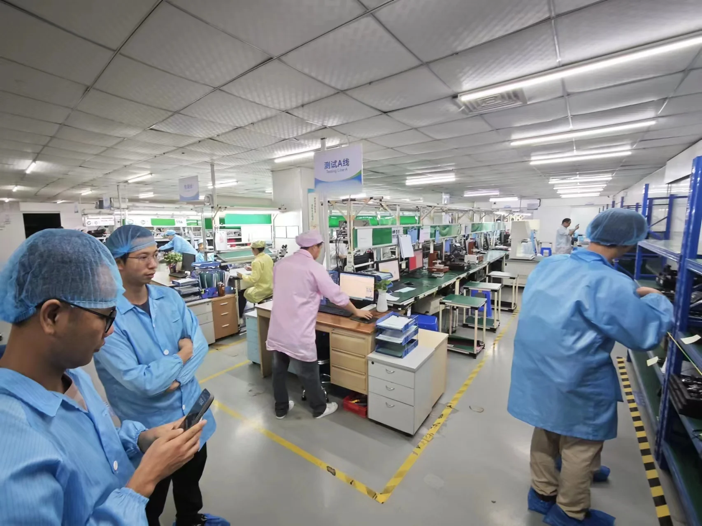
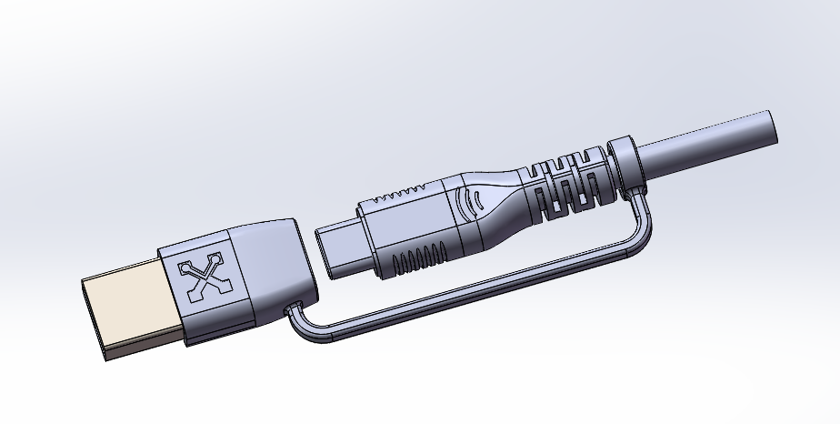
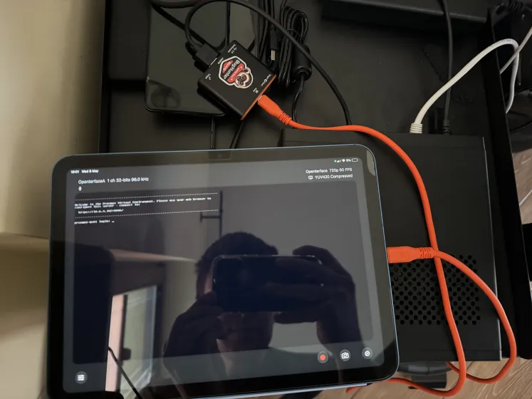

# Hit 1000% Funding & Crafting Quality: Inside Our Plans & More

Hi everyone!

We’re back with another update on our crowdfunding journey, and we've got some exciting news to share!

### Hitting a Major Milestone

First things first, we’re absolutely over the moon to announce that we’ve hit an astonishing [**1000% of our original funding goal**](https://www.crowdsupply.com/techxartisan/openterface-mini-kvm)! A massive thank you to each and every one of you. Your support has been nothing short of phenomenal!

### Production Planning

We’ve been super busy on the production front already! This week, we visited the tech hub of Shenzhen and had the chance to tour one of the top tech manufacturers. These folks work with big names like Meta, ABB, and Blaupunkt, and it was incredible to see their advanced production lines and quality control machinery in action. I wish I could share more photos, but here’s one with a bit of digital mosaic for confidentiality.

(We were discussing QC with the production line manager.)

We’re feeling very positive about this partnership and their enthusiasm to support a tech startup like ours. We’re committed to ensuring the manufacturing phase is handled with the utmost dedication and quality so we can get our product into your hands soon! Here’s a snapshot of our core team members at the factory entrance:

(From left to right: Shawn, Billy, Kevin, Vileer.)

### Upgrading Toolkit Accessories

We’re always looking for ways to improve, and our add-on **VGA-to-HDMI cable** has now been upgraded to 1 metre long with enhanced quality, as you can see from our previous [Week 2 update](https://www.crowdsupply.com/techxartisan/openterface-mini-kvm/updates/our-vga-to-hdmi-cable-is-now-available-to-european-backers-and-its-a-full-meter-long).

Next up, we’re also looking into our **1.5 metre long Type-C cable** for connecting to the host computer. Type-C is becoming increasingly common across new computers, laptops, and even servers. After testing many manufacturers, we found one that could produce this stylish orange Type-C cable with a lovely silicone feel that meets our quality standards.

Currently, **an extra Type-C-to-USB-A adapter is required** if our Mini-KVM works with a host computer that only has USB-A ports.

We know it’s a bit of a hassle, so we’re working closely with our manufacturer to improve it by **integrating an attached Type-C-to-USB-A adapter**. Here’s a mock-up of what it might look like.

We’re aiming to include this solution in our final toolkit package for backers, but I'm still crunching the numbers and giving my calculator a workout! This special Type-C cable doesn’t exist on the market and requires our custom OEM production. To make this happen, **we need more support to reduce the overall cost of production** for our mini-KVM toolkit. Given the current crowdfunding numbers and production costs, making this custom Type-C cable is becoming more and more feasible. I’ll keep everyone updated in the Openterface community on any progress!

If you find our project promising and believe the Mini-KVM can make your tech life easier, please do consider to back us up and help spread the word to your friends. Let’s secure the funds to make it even better while keeping it wallet-friendly for everyone in this crowdfunding campaign! Thanks a bunch!

### Open Source Updates and Global Teamwork!

Please bear with us during this early stage of development, as there are still bugs and changes happening in our host applications. That’s where our beta team comes in! We’ve already organised **two rounds of beta testing**. Check out our posts here to learn more:

- [Update on Applications for Beta Team Round 1](https://www.reddit.com/r/Openterface_miniKVM/comments/1bszggn/update_for_our_beta_test_applicants_round_1/) on Apr 1, 2024
- [Shipment to Beta Team Round 1](https://www.reddit.com/r/Openterface_miniKVM/comments/1cayi8v/meet_your_new_tech_allies_soon_beta_team/) on Apr 23, 2024
- [Application for Joining Beta Team Round 2](https://www.reddit.com/r/Openterface_miniKVM/comments/1cpcowl/make_your_mark_join_our_round_2_beta_testing_crew/) on May 11, 2024
- [Update on Applications for Beta Team Round 1](https://www.reddit.com/r/Openterface_miniKVM/comments/1cxr3zp/update_for_our_beta_test_applicants_round_2/) on May 22, 2024

Our beta team is truly international, with members from the US 🇺🇸, UK 🇬🇧, Japan 🇯🇵, Germany 🇩🇪, Czech 🇨🇿, Norway 🇳🇴, Belgium 🇧🇪, France 🇫🇷, Austria 🇦🇹, Australia 🇦🇺, Poland 🇵🇱, Netherlands 🇳🇱, China 🇨🇳 and more joining soon. These testers have development experience, real use cases for our device, and a passion for helping open-source projects like ours.

We received an overwhelming number of fantastic applications in Rounds 1 and 2, and it was a real challenge to narrow down the candidates from such a brilliant pool. We had to make some tough decisions due to the limited spots available at this exclusive phase! Even though most of you don’t have our devices yet, you can still review our code on GitHub and join the conversation with our beta and dev teams in [our community](https://openterface.com/community/)! Let us know what you find so we can make this device awesome together!

Here are updates on our open-source Github repo:

[**Openterface_MacOS**](https://github.com/TechxArtisanStudio/Openterface_MacOS)

Our Openterface MacOS host app is already officially live on the **Apple App Store**. Just search for 'Openterface' or 'mini-KVM' to find our app page. Even better, we’ve uploaded the full code to our GitHub repo: Openterface_MacOS for the Mini-KVM. You can check out this [basic operation demo](https://openterface.com/basic-testing/) on **MacOS**. Our beta team is already testing it, raising issues, and suggesting features for us to improve further.

[**Openterface_QT**](https://github.com/TechxArtisanStudio/Openterface_QT)

For the **Windows version**, check out our early demo video [here](https://openterface.com/basic-testing/). We’re tidying up the code for Openterface_QT and should have it on GitHub in a week or two.

Packaging for different **Linux versions**, like ARM32 and ARM64, especially for **Raspberry Pi**, is a bit of a headache, but we’re working on it. Expect a Linux demo soon, hopefully within a week.

**[Openterface_Android](https://github.com/TechxArtisanStudio/Openterface_Android) and [Openterface_WebExtension](https://github.com/TechxArtisanStudio/Openterface_WebExtension)**

We’ve completed the **proof of concept** for both Android and WebExtension. While these are lower priorities compared to macOS, Windows, and Linux, rest assured they’re in the pipeline. Based on our preliminary research, the Openterface_Android project might also support **ChromeOS**. If you have any insights, please join the discussion!

Even for iPadOS?

We’re also exploring compatibility with Apple’s mobile systems, like **iPadOS**. Due to Apple’s stringent controls, these platforms might not support wired connections with third-party devices. However, we’re investigating potential workarounds, especially for iPads with M series chips. Our beta mate **Seb** has already made [some interesting findings](https://discord.com/channels/1199611503469408276/1221755356896825424/1238070985794781265) and this is worth exploring further, though nothing is confirmed yet. If you have any insights or suggestions, join our community and let’s discuss!

[**Openterface_Mini-KVM_Hardware**](https://github.com/TechxArtisanStudio/Openterface_Mini-KVM_Hardware)

Coming soon too! We will start releasing the hardware details and code incrementally over the next two to three weeks. 

In the meantime, you can learn more about our project here: [How It Works](https://openterface.com/how-it-works/).This page explains our USB-HDMI capture integration, featuring the **CH9329** chip for keyboard and mouse control. Technical enthusiasts may find the details on this chip particularly interesting. Additionally, our mini-KVM utilises the **CH340** chip, supporting two built-in USB hubs for both the host and target sides. Our mini-KVM is comparable to many video capture cards currently on the market. For further technical details, please refer to this [datasheet](https://docs.google.com/document/d/1UPw5RwGTp0AjKL3wOvQZUS1hp3IPMxkCujtqy5haeP0/edit?usp=sharing).

Thank you for your understanding and patience!

### Addressing Concerns

We understand that some people may be sceptical, given the number of scam crowdfunding projects out there. Here are a few points that might reassure you about our crowdfunding project:

1. **Trust the Crowd Supply Platform:** This is *one of the top crowdfunding platforms for electronic products* in the US **since 2012**. You can read more about how your rights as a backer are protected on the Crowd Supply platform, including for our project: [Crowd Supply Guide: How are Backers Protected?](https://www.crowdsupply.com/guide/backer-protection)
> "Every project that has ever received funds through Crowd Supply has delivered to their backers (or is on track to do so). You are not funding someone’s pipe-dream; at Crowd Supply, you are purchasing an actual product."

    Moreover, the Crowd Supply team has been closely overseeing our development progress of the Openterface Mini-KVM and offering us professional advice to ensure that what we have been creating is just right for you. A shout of thanks to the Crowd Supply team here too!

2. **Trust the Experience of Our Team:** We are a group of versatile developers, skilful makers, and experienced project and production managers, especially in work that involves a blend of both hardware and software development. We are an innovative tech creative studio with *over six years of experience in advanced projects* in fields such as IoT, AI, edge computing, and tech art. To learn more about us, check out our [TechxArtisan Studio](https://techxartisan.com/en/) website.

3. **Trust the Culture of Our Team:** Our team is dedicated not only to technical excellence but also to the overall user experience. This includes everything from user and developer documentation to design aesthetics. We are passionate about cutting-edge gadgets and often have heated discussions within our team on new technologies from various perspectives to define what makes a good electronic product and how to bring it to life. This approach ensures our products enhance your tech life and reflect our commitment to quality and detail. Moreover, we embrace a culture of open source and community collaboration.

4. **Observe What We Have Achieved and Are Doing:** We’ve been working very hard on this project. You can join our community on Reddit and Discord, see what we have been crafting from the very early prototype to the current pre-production version, and stay informed about our up-to-date progress. We would love to see you in our community and engage with us!

5. **Chat with Us Directly:** Please don't hesitate to email me at info@techxartisan.com if you have any questions or concerns about our Mini-KVM. Additionally, we are planning to set up a livestream, invited by [**David Groom from MAKE: Magazine**](https://www.youtube.com/@MAKE/streams), for next **Wednesday, the 29th at 3 PM Eastern**. We'll discuss our Openterface Mini-KVM and the story behind it. This is a great opportunity to engage with us and ask questions about the product during the livestream! I will post more information about the Zoom code for joining the livestream on our Reddit and Discord communities soon.

Finally, we totally understand if you’re still unsure. That’s OK! If your work involves managing headless devices, we’re confident our efforts in crafting the Openterface Mini-KVM will eventually win you over. Wait and see! 😄

### What’s Next?

Stay tuned for next week’s update, where we’ll dive into more details about our host application functions, its roadmap, production progress, real use cases shared by our beta team, and more! In the meantime, check out our website [Openterface](https://openterface.com/) and [FAQs](https://openterface.com/faq/), consider [backing us on Crowd Supply](https://www.crowdsupply.com/techxartisan/openterface-mini-kvm), and help spread the word!

Thank you for reading and being part of this journey with us! Peace!

Best,

Billy Wang, Project Manager

Openterface Team | TechxArtisan Studio